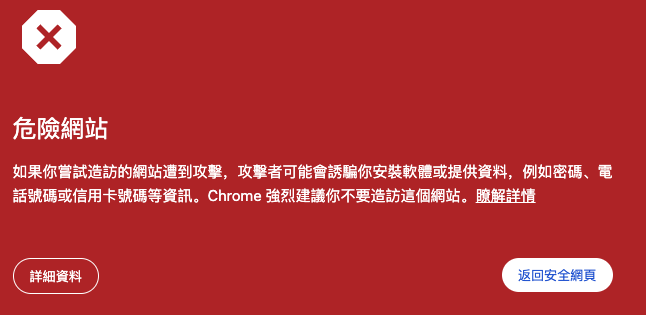
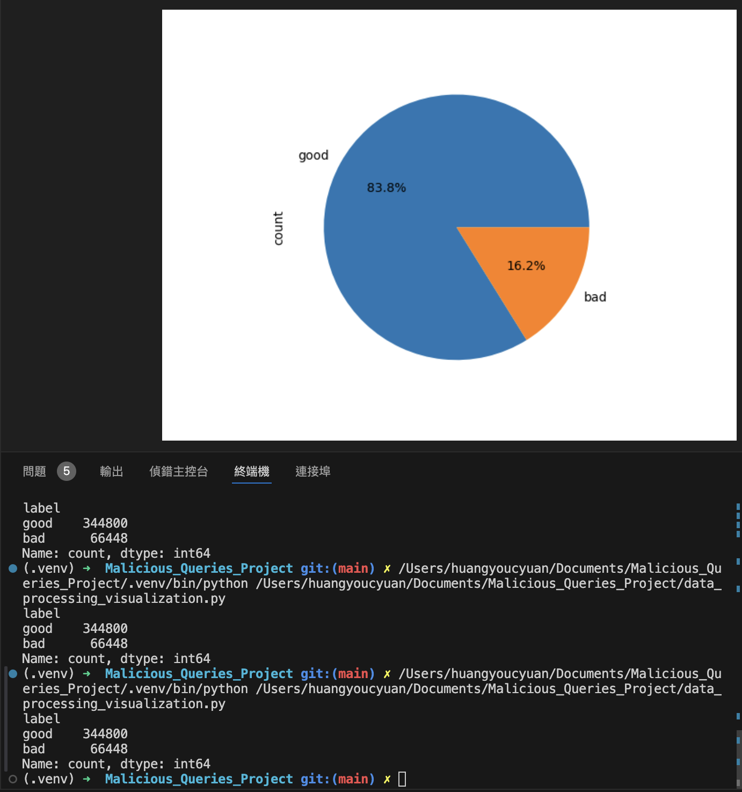
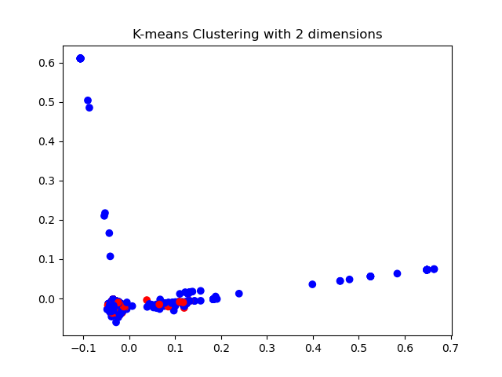

# Malicious_Queries_Project

## [Dataset](https://github.com/faizann24/Fwaf-Machine-Learning-driven-Web-Application-Firewall)

https://github.com/payloadbox/xss-payload-list/tree/master
https://www.kaggle.com/datasets/syedsaqlainhussain/cross-site-scripting-xss-dataset-for-deep-learning
https://gwern.net/dnm-archive#possible-uses
[XSS參考網站](https://hackercat.org/pentesting/xss-challenges-and-game)

title:惡意URL分析
goal：判斷使用者是否訪問惡意的URL
downstream task：使用BERT進行分類任務
project_url:https://github.com/IceTeaOxO/Malicious_Queries_Project
### dataset:
https://github.com/faizann24/Using-machine-learning-to-detect-malicious-URLs/tree/master
該資料集搜集了數十萬筆URL請求，並有標註good, bad的label
裡面的good, bad分類是由該網址是否是正常的網頁，還是會跳到博弈等相關連結的惡意URL
例如[ruiyangcn.com](ruiyangcn.com)

需要注意的是上面的資料因為年代久遠所以有些網頁URL已經失效了，但是仍然希望可以從上述的資料中訓練出一個分辨惡意URL可能規律的模型，像是大部分惡意連結較少使用.com結尾的網域。

data preprocessing:
1. 先將蒐集到的資料進行整合、去除重複資料後，約剩下40萬筆
2. 將資料做視覺化，查看label分佈，可以看到good有344800筆，bad有66448筆，資料略有點不平衡，但是比例沒有到特別懸殊可以先訓練看看，初步打算先設定weight參數試看看，將good的weight調小，bad調大。

3. 對good和bad的clustering有興趣，所以先使用TF-IDF進行向量化，在使用K-means，使用TF-IDF的原因是因為url會常常出現.com等文字，想要降低常常出現的文字的影響。

4. 為了更直觀地看到資料的關係，所以使用PCA將資料降到2維，因為資料太多，所以只取其中1000筆進行查看，紅色的是bad，藍色的是good，有一部份是靠很近的，所以預估模型的準確率不會太高，這個模型應該著重在Recall（能找出大部分的惡意URL）以及F1 Score（Precision和Recall的調和平均數）上。

model used:DistilBertForSequenceClassification
1. 進行訓練

results: